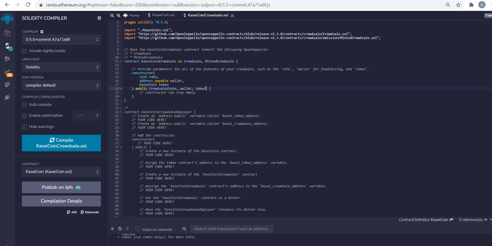

# Blockchain4

Creates a crowdsale for KaseiCoin in Solidity.  KaseiCoin (火星コイン) is a new cryptocurrency to be used on Mars.  KaseiCoin is an ERC-20 compliant fungible token.

## Evaluation Evidence

Testing has been performed using Remix (https://remix.ethereum.org), MetaMask (https://metamask.io) and Ganache (https://www.trufflesuite.com/ganache). 

\
KaseiCoin contract successfully compiled:

\
\
KaseiCoinCrowdsale successfully compiled:

\
\
KaseiCoinCrowdsaleDeployer successfully compiled:

\
\
\
Remix after the KaseiCoin crowdsale has been successfully deployed is shown below.  Note that this involves deploying using Injected Web3.  First the KaseiCoinCrowdsaleDeployer contract is deployed in Remix using a name of KaseiCoin, a symbol of KSEI and a wallet address matching one of the accounts in Metamask (which in turn links back to an account in Ganache).  Then the address in the deployment pane needs to be copied to the corresponding "At Address" after selecting the contract in the dropdown box for both KaseiCoinCrowdsale and KaseiCoin.

\
\
Metamask screenshot showing gas fee taken from initial account balance of 100 ether following successful deployment of crowdsale:

\
\
Account balances in Ganache following successful deployment of crowdsale (first account is used to manage the crowdsale, second account will be used to purchase tokens):

\
\
Remix and MetaMask just before confirmation of a purchase of 100 tokens:

\
\
Account balances after purchase of 100 tokens (hard to see anything except that a transaction has occurred in the second account as 100 wei is tiny):

\
\
Proof that the transaction occurred looking at the transaction list in Ganache:

\
\
Now purchase 2 ether's worth of tokens so can see the results in the account balances:

\
\
Purchaser's account balance in MetaMask after purchase:

\
\
Funds from the purchase have been withdrawn from the second account (purchaser) and deposited in the first account (account which manages the crowdsale): 

\
\
The list of all transactions is shown below.  It is interesting to note that the transaction worth 2 ether actually used less gas than the one worth 100 wei.

\
\
Total supply of minted tokens:\

\
\
Amount of wei raised in crowdsale:\
